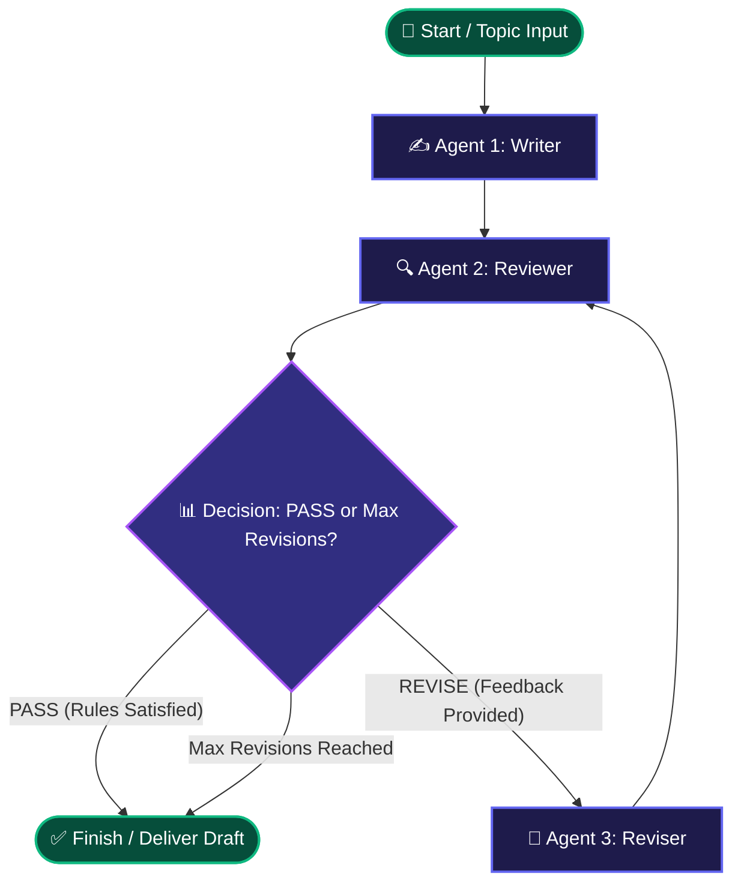
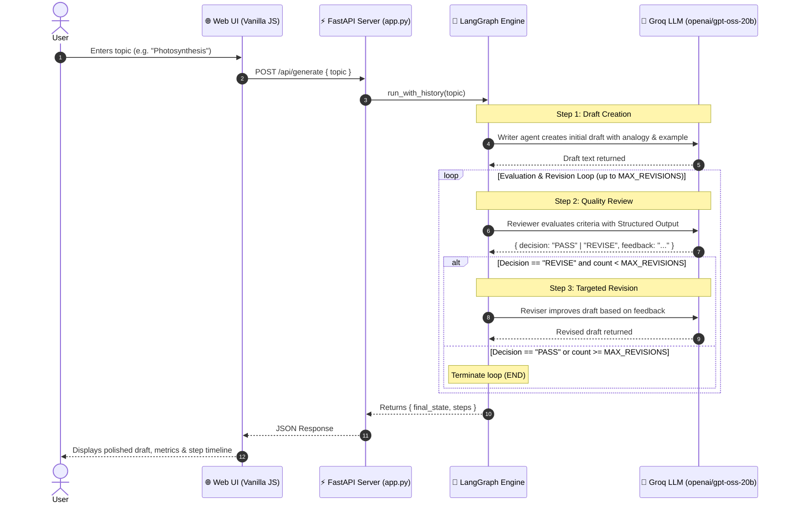

# 🔁 Agentic Loop: Self-Refining Multi-Agent Studio

An autonomous, iterative multi-agent system built with **LangGraph**, **FastAPI**, and **Groq**. The system employs an author-evaluator loop where three specialized AI agents collaborate to generate, critique, and refine educational explanations until strict quality standards are met.

---

## 📐 Architecture & Workflow

### 1. LangGraph State Machine Diagram



---

### 2. End-to-End Sequence Flow



---

## 🤖 The Multi-Agent Triad

| Agent | Role | Responsibility |
| :--- | :--- | :--- |
| **✍️ Writer** | Initial Author | Explains the topic in 120–160 words using beginner-friendly language, exactly one everyday analogy, and one concrete example. |
| **🔍 Reviewer** | Quality Gatekeeper | Strictly verifies if the draft is simple, contains an analogy, has an example, and remains on topic. Employs Pydantic structured output (`decision: PASS / REVISE`, `feedback: str`). |
| **🔄 Reviser** | Target Optimizer | Takes the current draft and reviewer's explicit feedback to rewrite and elevate the text while preserving simplicity and constraints. |

---

## 📦 State Schema (`TypedDict`)

Each node in the graph reads from and writes to the shared state:

```python
class State(TypedDict):
    topic: str             # The user's input subject
    draft: str             # Current version of the explanation
    feedback: str          # Actionable feedback from Reviewer
    decision: str          # "PASS" or "REVISE"
    revision_count: int    # Number of revision cycles completed
```

---

## 📂 Project Structure

```text
Loop Agents/
├── .env                  # Environment configuration (API keys & model)
├── app.py                # FastAPI web server and API endpoints
├── backend.py            # LangGraph workflow, nodes, and router
├── README.md             # Project documentation & architecture diagrams
├── static/
│   ├── app.js            # Frontend orchestrator, API caller & timeline renderer
│   └── style.css         # Dark glassmorphic styling, animations & layout
└── template/
    └── index.html        # Main interactive studio dashboard
```

---

## 🚀 Quickstart Guide

### 1. Prerequisites
- Python 3.10+
- [`uv`](https://github.com/astral-sh/uv) (recommended) or standard `pip`
- A [Groq API Key](https://console.groq.com/keys)

### 2. Setup Environment Variables
Create or verify `.env` inside the `Loop Agents` folder:

```env
GROQ_API_KEY="your-groq-api-key"
GROQ_MODEL="openai/gpt-oss-20b"
MAX_REVISIONS=2
```

### 3. Install Dependencies
Using `uv`:
```powershell
uv pip install fastapi "uvicorn[standard]" jinja2 langchain-groq langgraph pydantic python-dotenv
```

---

## 🖥️ Running the Application

### Option A: Run CLI Demo Directly
To test the multi-agent graph in your console:
```powershell
uv run "Loop Agents/backend.py"
```

### Option B: Launch Full-Stack Web App
To start the FastAPI interactive web studio:
```powershell
cd "Loop Agents"
uv run uvicorn app:app --reload --port 8000
```
Then open your browser at **[http://127.0.0.1:8000](http://127.0.0.1:8000)**.

---

## 📡 API Reference

### `POST /api/generate`
Executes the agent loop for a given topic.

#### Request:
```json
{
  "topic": "Photosynthesis"
}
```

#### Response:
```json
{
  "success": true,
  "topic": "Photosynthesis",
  "final_state": {
    "topic": "Photosynthesis",
    "draft": "Photosynthesis is how green plants make their own food...",
    "feedback": "",
    "decision": "PASS",
    "revision_count": 0
  },
  "steps": [
    {
      "node": "writer",
      "output": { "draft": "...", "revision_count": 0, "feedback": "", "decision": "" },
      "state": { "..." }
    },
    {
      "node": "reviewer",
      "output": { "decision": "PASS", "feedback": "" },
      "state": { "..." }
    }
  ]
}
```

---

## 🛠️ Tech Stack

- **Orchestration**: [LangGraph](https://github.com/langchain-ai/langgraph)
- **LLM Provider**: [Groq Cloud](https://groq.com/) with high-speed inference
- **Web Backend**: [FastAPI](https://fastapi.tiangolo.com/) & [Uvicorn](https://www.uvicorn.org/)
- **Templating**: [Jinja2](https://jinja.palletsprojects.com/)
- **Frontend**: Vanilla HTML5, CSS3 Glassmorphism, Modern JavaScript (ES6+)
- **Data Validation**: [Pydantic v2](https://docs.pydantic.dev/)
